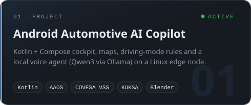
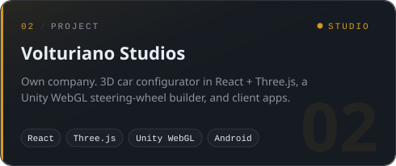
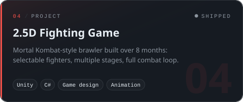

  <a href="https://firatportfolio.com"><b>Portfolio</b></a> &nbsp;·&nbsp;
  <a href="https://www.linkedin.com/in/firat-kaya-baba45267"><b>LinkedIn</b></a> &nbsp;·&nbsp;
  <a href="mailto:Firat05_@hotmail.com"><b>Email</b></a>

 

## Featured build

**[Android Automotive AI Copilot Infotainment](https://github.com/Firathubgit/android-automotive-ai-copliot-infotainment)**: a 3D car scene built in Blender, turned into a working Android Automotive cockpit.

 

## Projects

<table>
  <tr>
    <td width="50%"></td>
    <td width="50%"></td>
  </tr>
  <tr>
    <td width="50%"></td>
    <td width="50%"></td>
  </tr>
</table>

More repos: [FiratPortfolioWebsite](https://github.com/Firathubgit/FiratPortfolioWebsite) · [PythonCourse](https://github.com/Firathubgit/PythonCourse) · [all repositories →](https://github.com/Firathubgit?tab=repositories)

 

## Stack

  
   
  

 

## Activity

