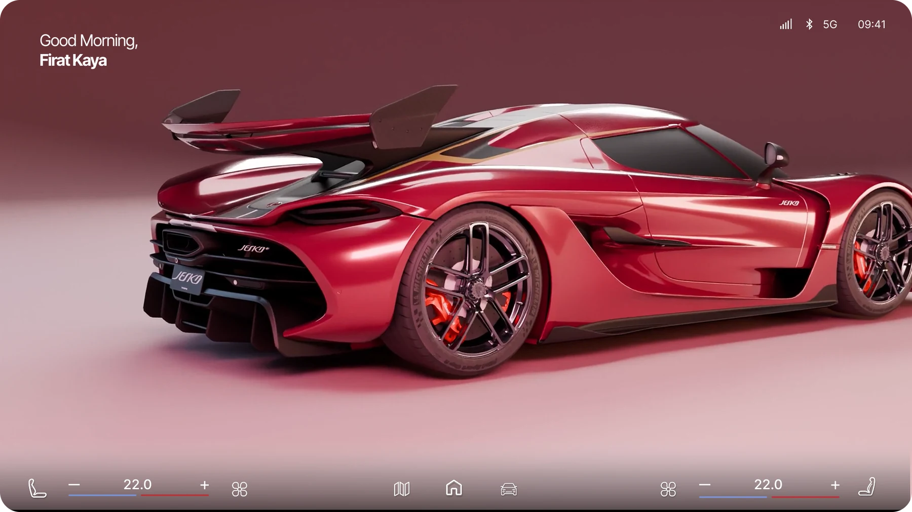
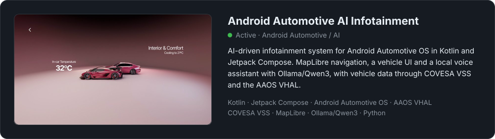
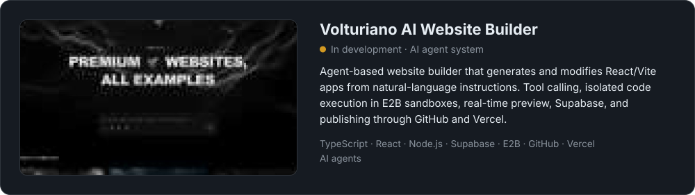
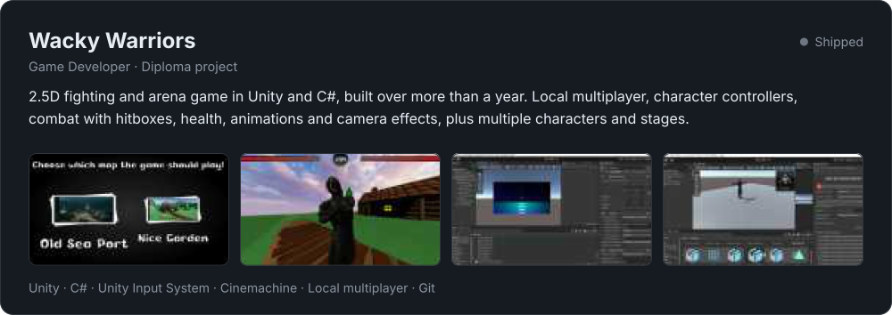

 

  <a href="https://firatportfolio.com"><picture><source media="(prefers-color-scheme: light)" srcset="assets/btn-portfolio-light.svg"/></picture></a>
  &nbsp;&nbsp;&nbsp;&nbsp;&nbsp;
  <a href="https://www.linkedin.com/in/firat-kaya-baba45267"><picture><source media="(prefers-color-scheme: light)" srcset="assets/btn-linkedin-light.svg"/></picture></a>
  &nbsp;&nbsp;&nbsp;&nbsp;&nbsp;
  <a href="mailto:firat05_@hotmail.com"><picture><source media="(prefers-color-scheme: light)" srcset="assets/btn-email-light.svg"/></picture></a>

 

## Activity

 

## Featured build

**[Android Automotive AI Copilot Infotainment](https://github.com/Firathubgit/android-automotive-ai-copliot-infotainment)**: a 3D car scene built in Blender, turned into a working Android Automotive cockpit.

 

## Stack

  
   
  

 

## Projects

More repos: [FiratPortfolioWebsite](https://github.com/Firathubgit/FiratPortfolioWebsite) · [PythonCourse](https://github.com/Firathubgit/PythonCourse) · [all repositories →](https://github.com/Firathubgit?tab=repositories)
