  

<table>
  <tr>
    <td width="50%"></td>
    <td width="50%"></td>
  </tr>
</table>

 

## ▸ Featured build

**[Android Automotive AI Copilot Infotainment](https://github.com/Firathubgit/android-automotive-ai-copliot-infotainment)**: a 3D car scene built in Blender, turned into a working Android Automotive cockpit.

`Kotlin` `Jetpack Compose` `AAOS VHAL` `COVESA VSS` `KUKSA / gRPC` `Ollama · Qwen3` `Blender` `Figma`

 

## ▸ Projects

<table>
  <tr>
    <td width="50%"></td>
    <td width="50%"></td>
  </tr>
  <tr>
    <td width="50%"></td>
    <td width="50%"></td>
  </tr>
</table>

More repos: <a href="https://github.com/Firathubgit/FiratPortfolioWebsite">FiratPortfolioWebsite</a> · <a href="https://github.com/Firathubgit/PythonCourse">PythonCourse</a> · <a href="https://github.com/Firathubgit?tab=repositories">all repositories →</a>

  

## ▸ Stack

  
   
  

 

## ▸ Telemetry

<picture>
  <source media="(prefers-color-scheme: dark)" srcset="https://raw.githubusercontent.com/Firathubgit/Firathubgit/output/snake-dark.svg"/>
  <source media="(prefers-color-scheme: light)" srcset="https://raw.githubusercontent.com/Firathubgit/Firathubgit/output/snake.svg"/>
  
</picture>

 

<b>How this profile works</b>

 

- **Portrait:** `scripts/prep_photo.py` cuts the background out of the photo (rembg) and boosts local contrast. `scripts/make_ascii_svg.py` then maps brightness to glyphs in three ink tones and animates a terminal-style print.
- **Header, info card, project cards:** generated by Python into plain SVG. All animation is SMIL/CSS, because GitHub strips JavaScript but still plays SVG animations.
- **Heatmap:** `.github/workflows/update-profile.yml` runs every morning. It scrapes public contribution data, renders `assets/heatmap.svg`, updates the degree-progress bar and commits the result.
- **Snake:** [Platane/snk](https://github.com/Platane/snk) runs in the same workflow and publishes to the `output` branch.

